# pyBible
**PROJET EN COURS DE REALISATION**  

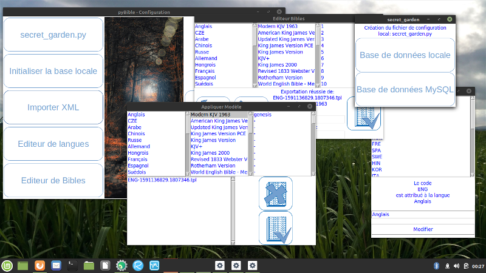 

Outil de lecture et d'études bibliques OpenSource.  

## (DEV) Importer Bible XML
 
Setup_GUI.py fonctionne avec tkinter, c'est donc une application fenetrée.  
C'est l'interface de configuration principale du projet.  
Elle permet l'importation des Bibles contenues dans ./data au format xml.  
Les Bibles doivent contenir 66 livres (voir le code source pour plus de détails).  

> Les Bibles originales au format xml viennent de Zefania https://sourceforge.net/projects/zefania-sharp/  
> Certaines ont été excluses car elles ne permettaient pas une importation convenable dans notre base de donnée actuelle.  

### secret_garden.py

C'est le fichier de configuration de la base de donnée utilisée par pyBible, vous pouvez le modifier depuis Setup_GUI.py  

### Setup_GUI

Ce script est à utiliser pour générer la base de données et initialiser les données de configuration. Il est à exécuter AVANT toute compilation.  
Sauf si vous utilisez directement les scripts, il ne peut pas être utilisé après compilation. C'est un outil destiné aux dévelopeurs permetant de générer et / ou configurer la base de données.  

### (DEV) Todo Setup_GUI

- Gestion des bookmarks - en cours -

## (DEV) Todo pyBible

### Lecture d'une Bible

- Sélection d'une Bible par défaut.  
- Reprendre la lecture là où on l'avais laissée.  

#### Marque pages

- Gestion d'un carnet de marque page (avec nomage de chaque marque page).  

#### Commentaires

Cette section reflète les idées en l'air pour une évolution future...  

Possibilité d'ajouter des commentaires:  
- Bible
- Livre
- Chapitre
- Verset (par défaut)
- Possibilité de suivre un plan de lecture en fonction de la date actuelle (fêtes et évènements spéciaux inclus)

### Création d'un site internet

- Création d'un site internet pour le peojet.  
- Portage sous Windows  
- Portage sous Android  

## Utilisateurs

Sous Windows, débrouillez-vous, vous avez l'habitude.  
Sous Linux, allez dans le répertoire destiné aux code sources. Vous devez être sous un environement graphique.  

#### Réalisez une copie locale de ce dépôt:  
git clone https://github.com/cgifl300/pybible.git  
#### Ensuite allez dans pybible:  
cd pybible  
#### Reconstituez l'environement python avec toutes ses librairies:  
make init  
#### Lancez l'interface de configuration:  
make setup  
L'interface de configuration et de génération de la base de donnée derait s'ouvrir:  
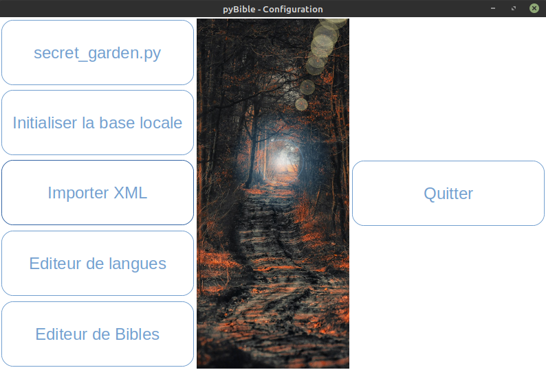   
Vous pouvez faire le trie des Bibles qui vous intéresse en supprimant celles qui ne vous intéresse pas dans data/xml .

Vous trouverez une base de donnée déjà construite en téléchargement sur mon site personnel https://www.blueroses.fr/dl/pybible.db . C'est la méthode d'installation recommandée si vous désirez utiliser toutes les traductions disponibles.  
Dans ce cas il vous suffira d'indiquer le chemin de la base de donnée sqlite en cliquant sur 'secret_garden.py'.  

Pour ceux qui désirent générer leur propre base de donnée, une fois le chemin et le type de base de donnée configuré dans secret-garden.py il fous suffit cliquez sur 'initialiser la base locale'. Que votre base soit sqlite ou mysql, elle devra être initialiser, cette étape créé les tables et tous les bidules dont le logiciel a besoins dans la base de données.  

#### Importer XML  

L'importation XML peut être longue, surtout sur des configuration légère, vous trouverez une base de donnée déjà construite en téléchargement sur mon site personnel https://www.blueroses.fr/dl/pybible.db . C'est la méthode d'installation recommandée si vous désirez utiliser toutes les traductions disponibles.  
L'importation XML importe toutes les Bibles présentes dans data/xml .  
L'application se fige alors pour éviter toute interaction avec la base de données... allez boire un café ou deux.  

#### Editeur de langues  

L'éditeur de langues permet d'éditer la correspondance entre les codes langue et l'éctiture littérale de celle-ci.  
*Exemple: FRE -> Français*  

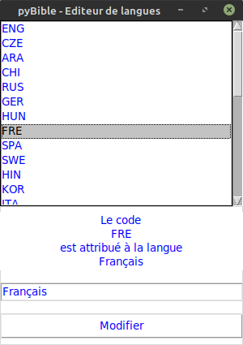  

#### Editeur de Bibles  

L'éditeur de Bibles permet l'édition du nom des différents livres contenu dans chaque Bible ainsi que leur diminutif.  
L'utilisation de modèles (templates) est recommandée. Vous pouvez les créer depuis l'interface de configuration et les appliquer à une autre Bible ensuite.  

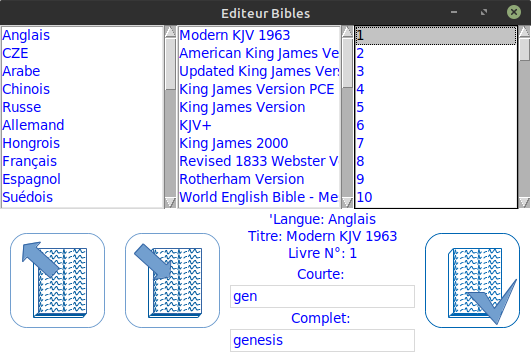   

Vous pouvez éditer le nom long et court de chaque Bible, n'oubliez pas de valider pour que les changements soient pris en compte.  

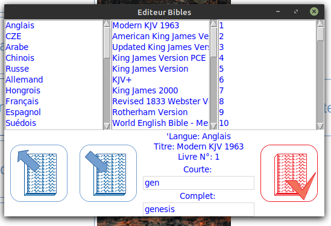   

Il vous suffit de cliquer sur 'exporter' pour exporter le modèle utilisé pour la Bible sélectionnée.  

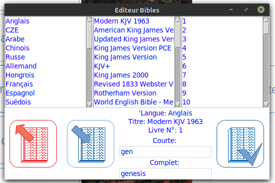   
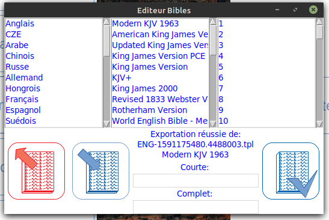   

Pour l'appliquer à une autre Bible, il vous suffit de cliquer sur 'importer'.  

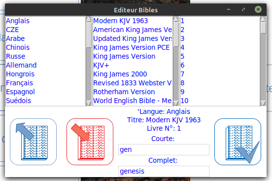   

L'interface d'importation s'affiche alors. Vous retrouverez vos modèles (templates) ainsi que les Bibles présentes dans la base de donnée.  

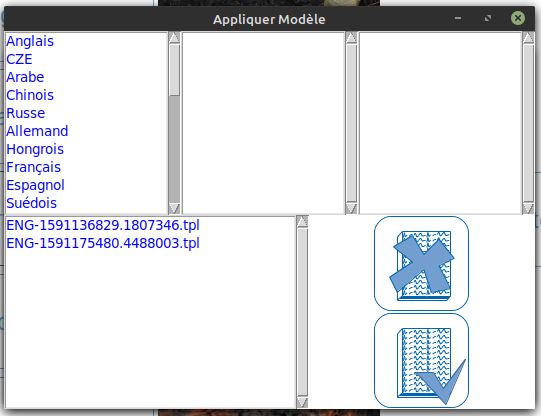   

Sélectionnez la Bible à laquelle vous désirez appliquer le modèle, le nomage actuel des livres s'affiche.  

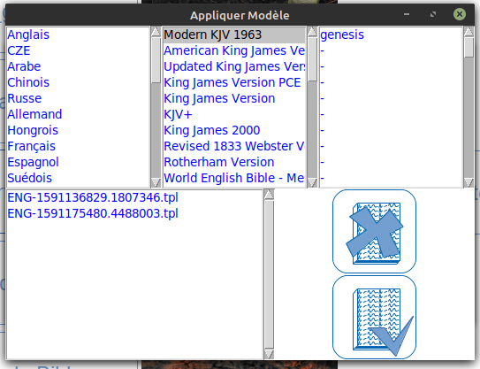   

Vous pouvez annuler à tout moment en cliquant sur le bouton 'annuler'.  

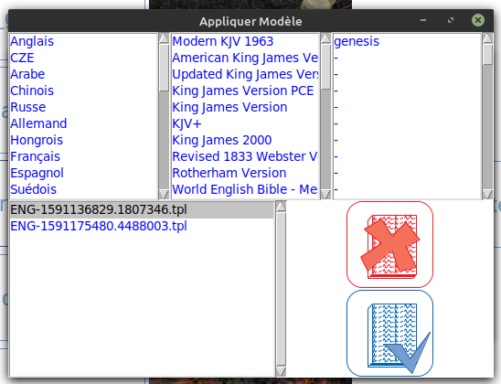   

Une fois la Bible et le modèle choisis, il vous suffit de valider les modification en cliquant sur 'valider' à ce moment là, l'ancien nomage est remplacé par celui du modèle. Les noms des livres sont modifié!  

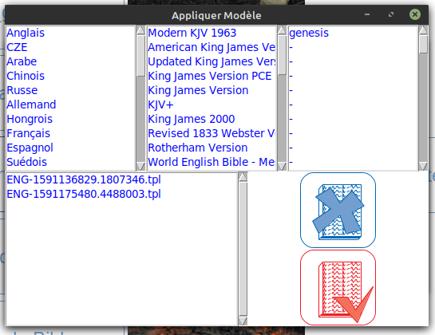   
