==============
How to Install
==============

`Roadmap https://github.com/users/cGIfl300/projects/4`__

.. _roadmap: https://github.com/users/cGIfl300/projects/4
__ roadmap_  

|bgv|

OpenSource Bible Reading Tool  

Import XML Bible
================
 
Setup_GUI is working with a desktop only, no CLI.
This is the main Setup Tool you'll need.

Once you cloned this repository using:

git clone https://github.com/cgifl300/pybible.git

You will also dl a directory containing all Bible in all language. You should considere removing the Bibles you won't use from ./data/xml

secret_garden.py
----------------

This is the main setup file, you can switch language into english from there, just open a text editor to change the language of the software. (en = english)
You can also change the color theme from this file.
Most options can be edited from Setup_GUI.py

Setup_GUI
---------

This script must be used to generate the database and to init setup. 

Source Code Install
===================

Under linux with GUI.
You can also do the same under windows, but I do not use this operating system, you will perhaps have to adapt some commands (you cannot directly use makefiles on windows).

Clone this repository  
---------------------

git clone https://github.com/cgifl300/pybible.git  

Go into pybible:  
----------------

cd pybible  

Rebuild the virtualenv:  
-----------------------

make init  

Launch the initial setup:  
-------------------------

make setup  

Setup interface should be now opened (Setup_GUI is not translated): 

|001|   

You can delete useless Bibles in data/xml .

You can dl all Bibles in a single database at https://blueroses.fr/pybible/dl/pybible.db .  
If you choose this method just click on 'secret_garden.py'.  

For those who choosed to create their own database, once the path of the database is defined into secret-garden.py you can click on 'initialiser la base locale' whatever your database is sqlite or mysql.

Import XML  
----------

Import XML take much time, you should considere using a pre-built database at https://blueroses.fr/pybible/dl/pybible.db .

XML Import imports all XML Bibles from data/xml .

Meanwhile, Setup_GUI is frozen, you have to wait few hours... let's have a drink!  

Language Editor  
---------------

The language editor permits to change the definition of languages shortcuts and litteral strings.  
*Exemple: FRE -> Français*  

|002|  

Bibles Editor  
-------------

Bible Editor permits to edit differents books names into Bibles and their shortcut.

You can use templates you can create from the setup interface.

|003| 

You can edit long and shortcut names. Don't forget to validate your changes.  

|006|   

Once a template is ready, you can 'export' it clicking on 'export'.  

|005|   
|007|   

To apply a template, just click on 'import'.

|004|   

Import GUI will now open. You can check your templates here.  

|008|   

Select a Bible on wich you want to apply the template. Actual books names will be printed.

|009|   

You can cancel anytime clicking on 'cancel'.

|010|   

Once you Bible and template are selected, just validate clicking on 'validate'. The new books names is applyed.

|011|   

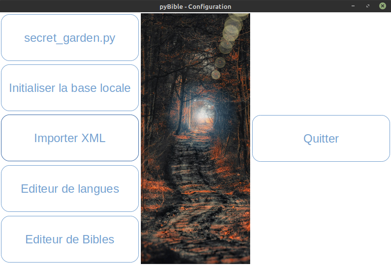
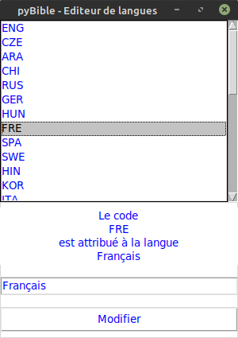
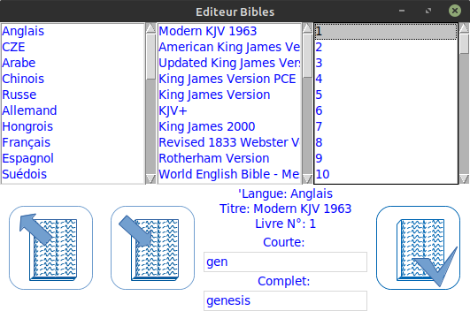
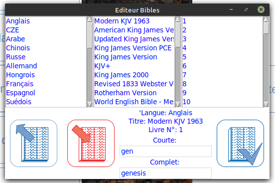
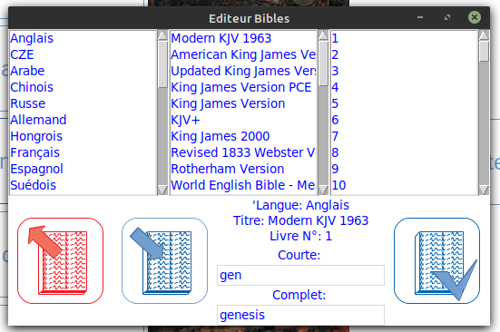
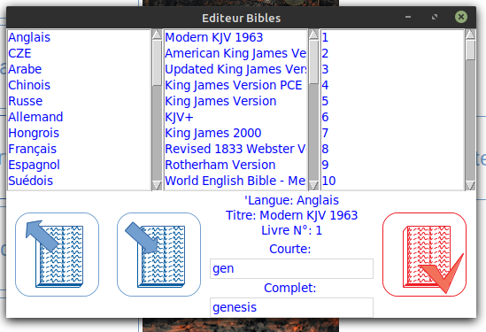
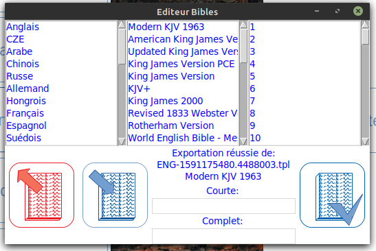
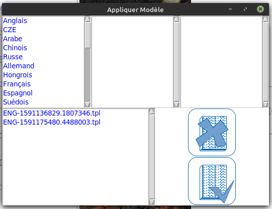
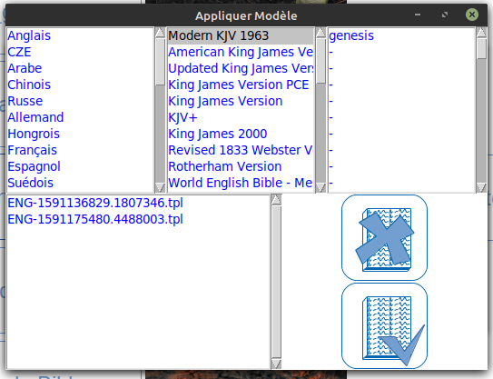
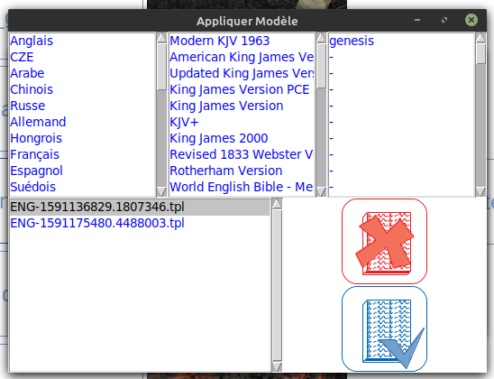
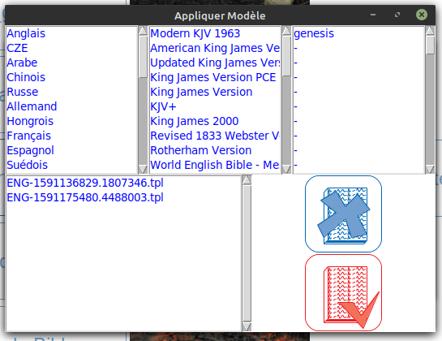
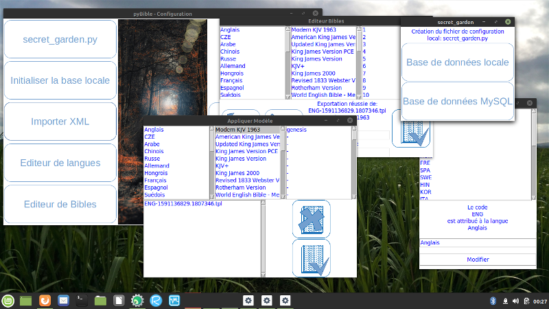
