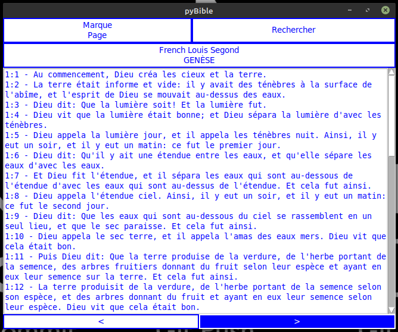
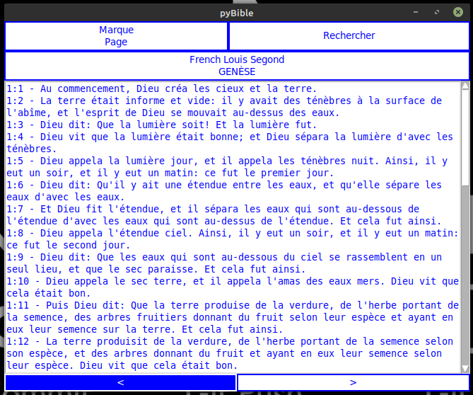
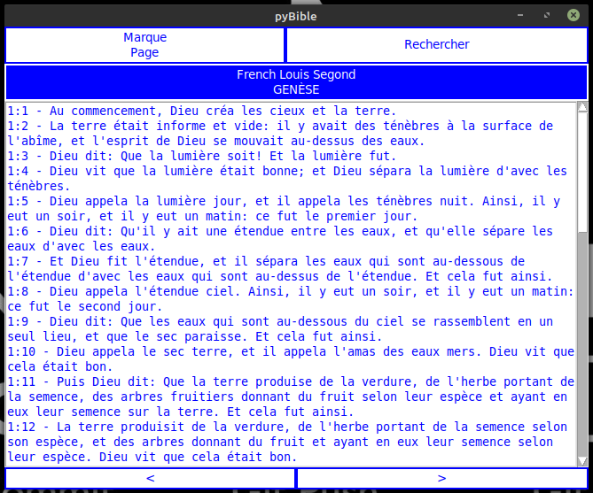
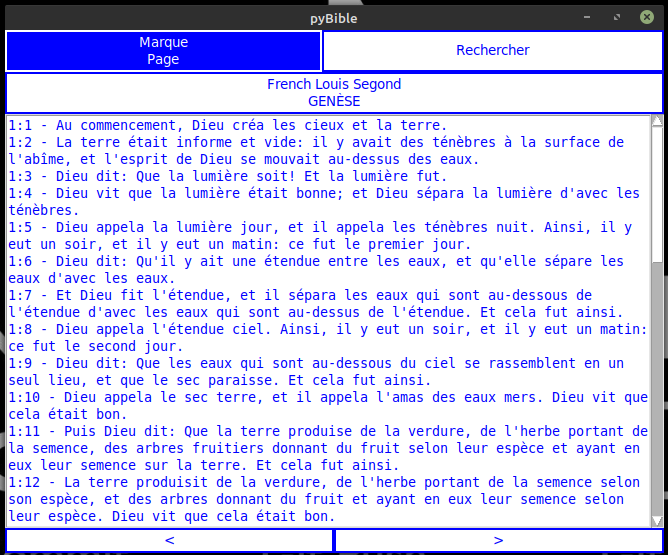
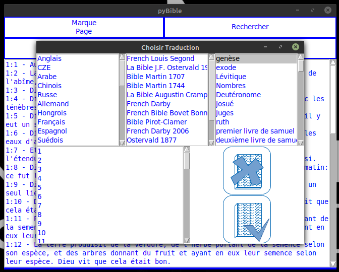
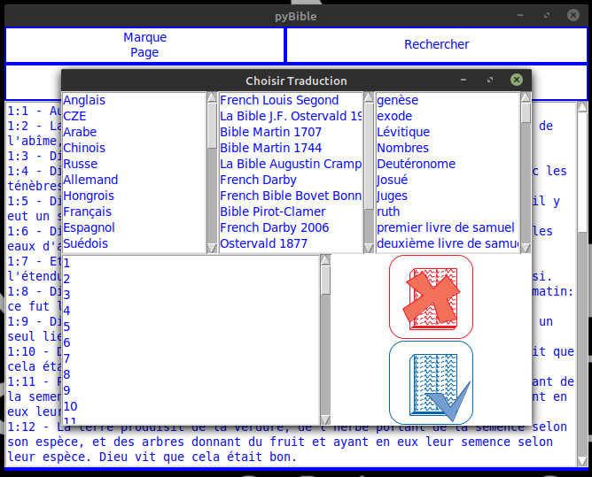

.. pyBible documentation master file, created by
   sphinx-quickstart on Thu Mar 12 18:29:57 2020.
   You can adapt this file completely to your liking, but it should at least
   contain the root `toctree` directive.
   
==================
User Documentation
==================

:doc:`index-en`

|logo|

.. toctree::
   :maxdepth: 2
   :caption: Contents:
   
=====
Index
=====

* `Read a Bible`_
* `Switching translation`_
* `Bookmarks`_
* `Search`_

Read a Bible
============

Here is the main interface.

|001|

You can turn to the next chapiter clicking on "next".

|002|

You can turn to the previous chapiter clicking on "previous".

When shutting down the application, the actual chapiter is recorded and restaured at the next start.

Switching translation
=====================

Click on the actual translation to switch.

|003|

Select the translation you want to use.

|007|

|008|

Or cancel.

|009|

Bookmarks
=========

You can use your own bookmarks.

|004|

|011|

By clicking on "go" the selected bookmark is printing to the main window.

|012|

You can also delete a bookmark.

|013|

Search
======

You can search for one word or phrase into the actual active Bible translation.

|005|

Results will be printed by books.

|010|
   
.. |logo| image:: _static/logo-small.png
.. |001| image:: _static/001.png

.. |006| image:: _static/006.png

.. |008| image:: _static/008.png

.. |010| image:: _static/010.png
.. |011| image:: _static/011.png
.. |012| image:: _static/012.png
.. |013| image:: _static/013.png
