.. pyBible documentation master file, created by
sphinx-quickstart on Thu Mar 12 18:29:57 2020.
You can adapt this file completely to your liking, but it should at least
contain the root `toctree` directive.

=========================
Documentation utilisateur
=========================

:doc:`index-en`

|logo|

.. toctree::
   :maxdepth: 2
   :caption: Contents:
   
==================
Table des matières
==================

* `Lire une Bible`_
* `Changer de traduction`_
* `Marque-pages`_
* `Rechercher`_

Lire une Bible
==============

L'interface principale se présente de cette façon.

|001|

Vous pouvez aller au chapitre suivant en cliquant sur "suivant".

|002|

Vous pouvez aller au chapitre précédent en cliquant sur "précédent".

|003|

Lorsque vous fermez l'application, à la prochaine ouverture, le dernier chapitre en cours de lecture sera affiché à nouveau.

Changer de traduction
=====================

Cliquez sur le nom de la traduction actuelle pour changer de traduction de Bible.

|004|

Il vous suffit alors de choisir la traduction désirée.

|007|

|008|

ou d'annuler l'opération

|009|

Marque-pages
============

Vous pouvez gérer vos propre marque pages.

|005|

En cliquant sur "aller" le marque-page est alors affiché dans la fenètre de lecture principale.

|012|

Vous pouvez aussi supprimer un marque-page en cliquant sur supprimer une fois celui-ci sélectionné.

|013|

Rechercher
==========

Vous pouvez chercher un ou plusieurs mots dans la traduction actuelle.

|006|

Les résultats de recherche s'affichent alors ordonnés par livres.

|010|
   
.. |logo| image:: _static/logo-small.png
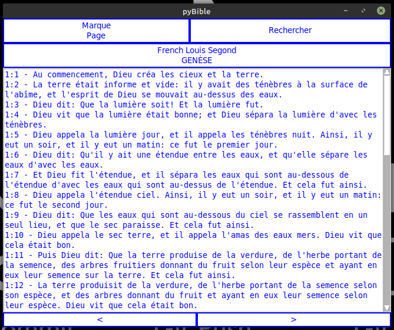
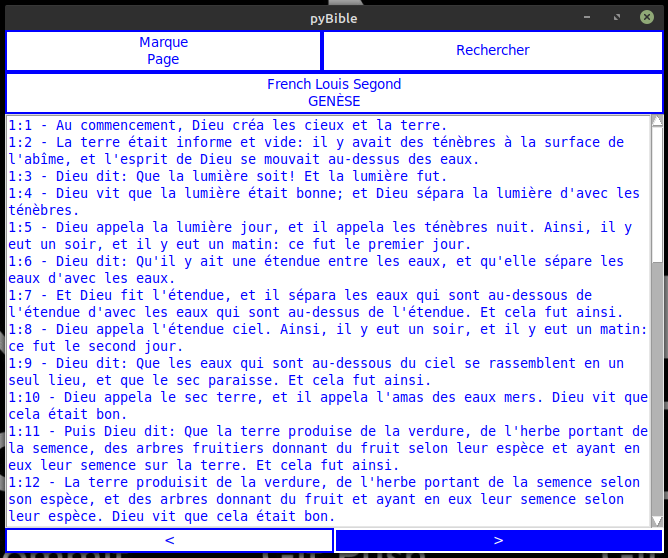
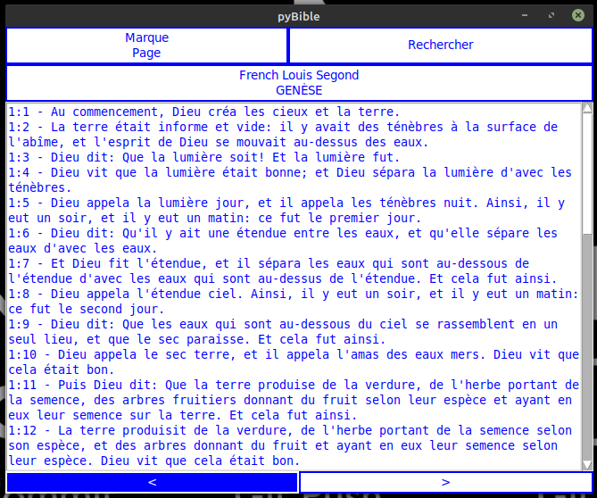
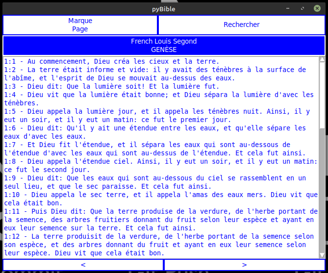
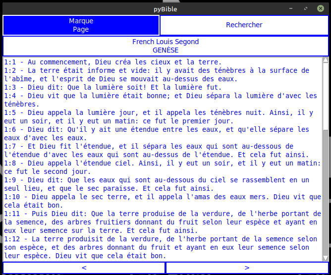
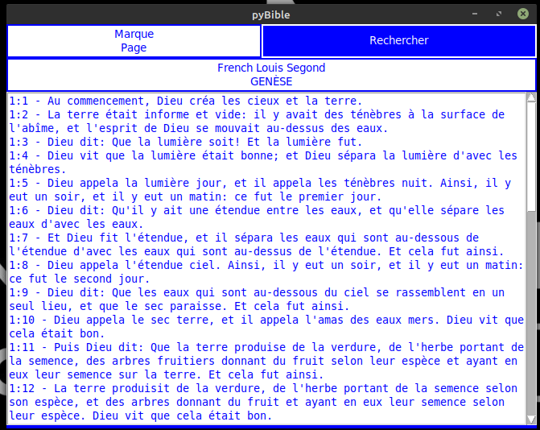
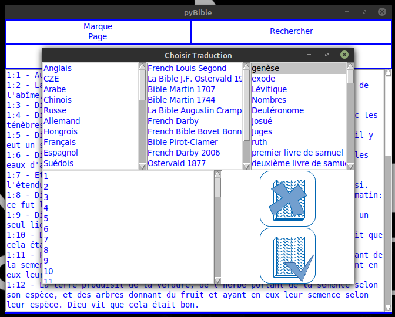
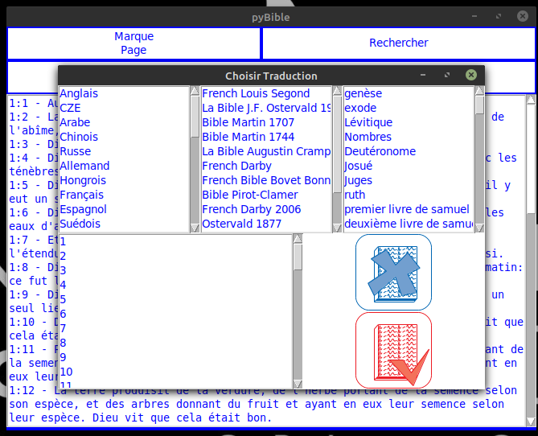
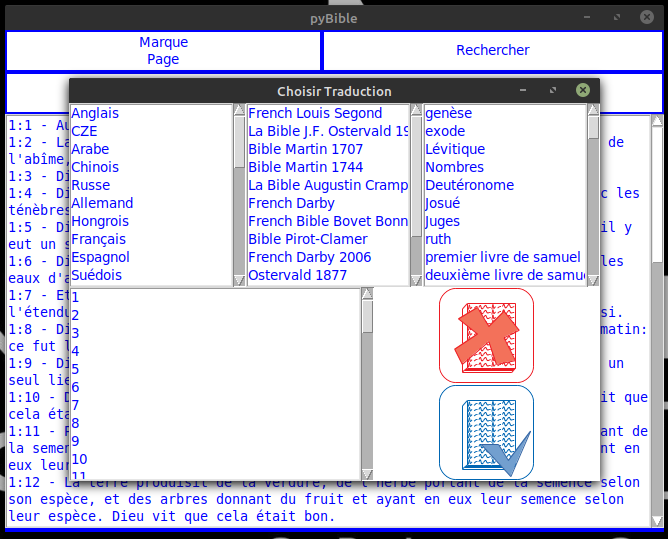
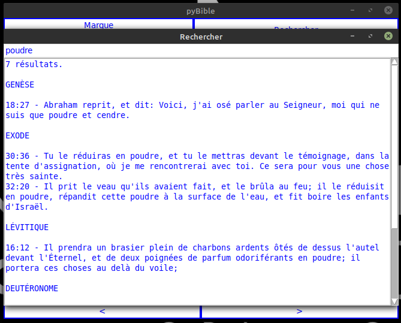
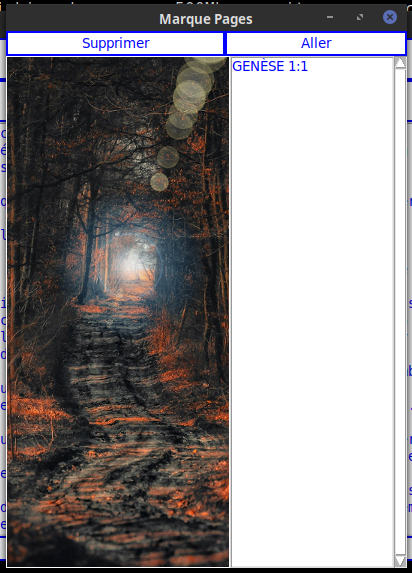
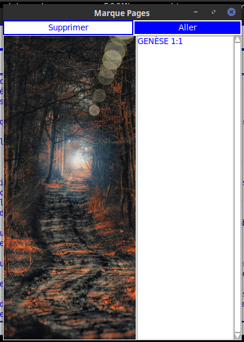
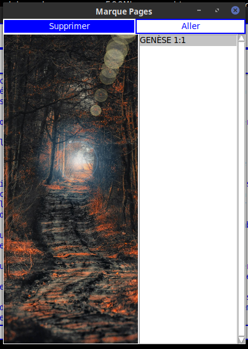
